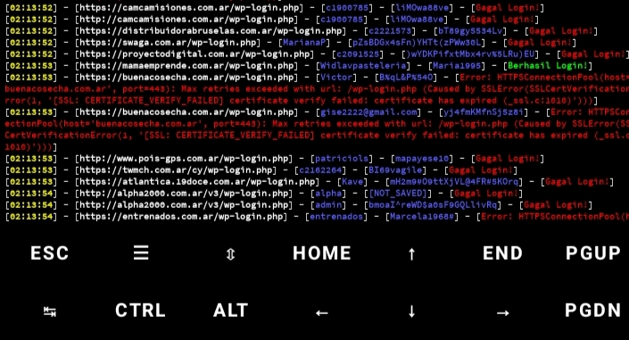
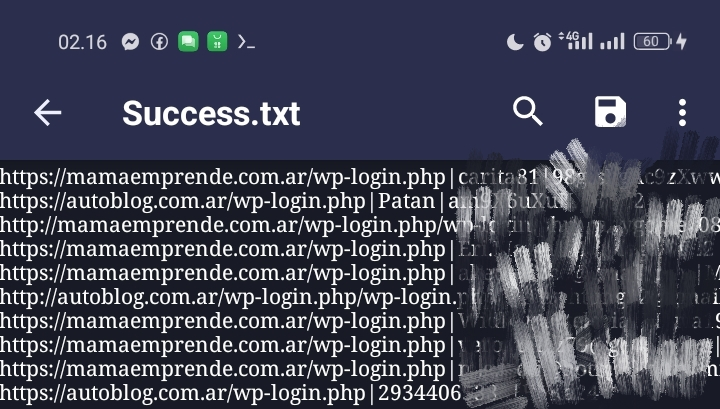

<h1>OtomatisWp</h1>

Tools Ini Dirancang Untuk Menguji Kredensial Akun (Username & Password) Pada Ratusan URL (Wp-Login.Php) Secara Otomatis. Tools Ini Berjalan Di <b>Termux</b> atau <b>Linux</b>, Cocok Digunakan Untuk Pengecekan Massal Validitas Akun Pada Situs Berbasis Wordpress.

     

<h2> Fitur 🚀</h2>
<ul>
  <li>▶ Succes.txt Untuk Menyimpan Hasil Login Berhasil</li>
  <li>▶ Falied.txt Untuk Menyimpan Hasil Login Gagal</li>
  <li>▶ Mudah digunakan melalui<b>CLI (Command Line Interface)</b></li>
</ul>

<h2> Instalasi 🌐</h2>
<ol>
  <li><b>Clone repositori ini</b> ke perangkat Anda:</li>
  <pre><code>git clone https://github.com/Rolandino777/AutoWp.git</code></pre>
  <li><b>Masuk ke direktori proyek:</b></li>
  <pre><code>cd AutoWp</code></pre>
  <li><b>Jalankan skrip:</b></li>
  <pre><code>python AutoWp.py</code></pre>
</ol>

<h2>Cara Penggunaan ⚙️</h2>

Setelah Menjalankan Tools Anda Akan Di Minta Untuk Memasukan (target.txt) Yang Berisi Target Wopres Anda Dengan Format Validasi Seperti Ini 
(http://hiperbaricamendoza.com.ar/wp-login.php|liliana|karlos123) Masukan Dalam (target.txt) !

<h2> Contoh Penggunaan 📝</h2>

Install Script Diperangkat Anda, Jika Duda Maka Jalankan

<pre><code>python AutoWp.py</code></pre>

Lalu Ikuti Instruksi Yang Ditampilkan.

<h2>Lapor Bug 🛠</h2>

  

  

  <a href="https://t.me/rolandino28" target="_blank">
    
